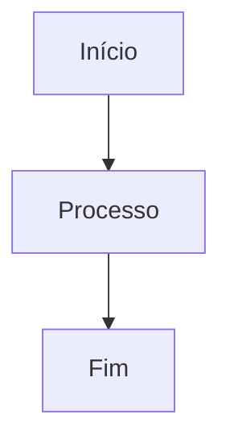

# 📘 Guia Rápido de Markdown (MD)

Este é um resumo das funções mais importantes do Markdown para criar anotações limpas, organizadas e fáceis de ler no GitHub.

---

<!-- É dessa maneira que se coloca um comentário de invisvel que não vai ser visto no markdown -->

## 🏷 Títulos

```md

Use `#` para criar títulos e subtítulos.

# Título 1
## Título 2
### Título 3
#### Título 4

```
<!-- Depois de usar o ```md no começo da seção que você quer marcar, use no final ``` para fechar -->

## ✍️ Ênfase (itálico e negrito)

- *itálico*
- **negrito**
- ***negrito + itálico***

## 📌 Listas
Lista não ordenada

- Item 1
- Item 2
  - Subitem

Lista ordenada

1. Primeiro
2. Segundo
3. Terceiro

## 🔗 Links

[Texto do link](https://meulink.com)

📁 Links internos (para pastas e arquivos no GitHub)

- [Arquitetura de Computadores](Arquitetura%20de%20computadores/)
- [Resumo de Algoritmos](resumo-algoritmos.md)

🖼 Imagens


##📦 Blocos de código

Use a função `print()` para exibir valores.

Bloco com linguagem (para highlight no GitHub)

```python
def soma(a, b):
    return a + b
```
---

## 🧱 Citações

> Isso é uma citação.
> Pode ter várias linhas.

## 📊 Tabelas

| Disciplina | Status |
|-----------|--------|
| Algoritmos | ✔️ |
| Arquitetura | ✔️ |
| Redes | ❌ |

## 🧩 Separadores
---

## 🔄 Checklists

- [x] Estudar algoritmos
- [ ] Revisar arquitetura
- [ ] Subir arquivos no GitHub

## 🎨 Blocos informativos

> **Nota:** Isso é importante.
> **Atenção:** Isso requer cuidado.

## 🗺 Diagramas Mermaid (renderizam direto no GitHub)


